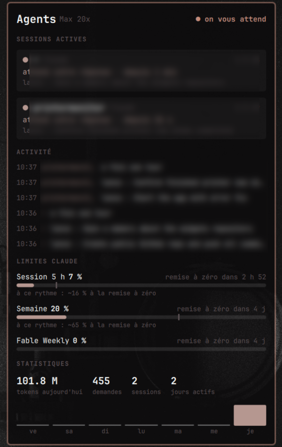
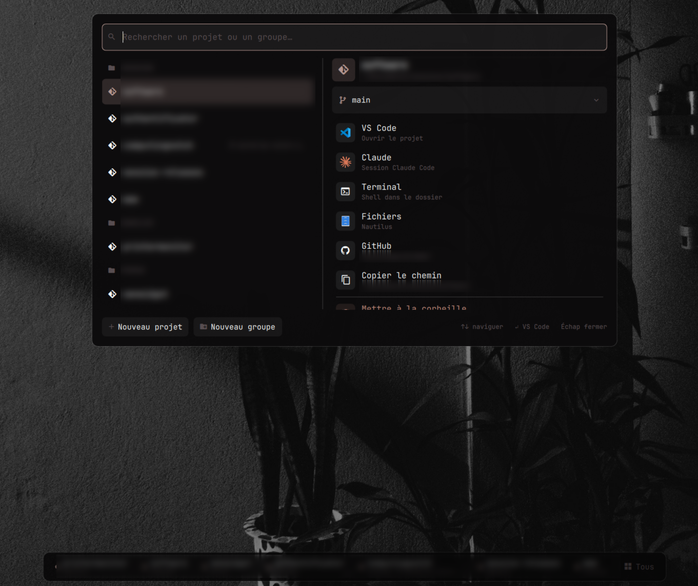

# ownwidget

Widgets de bureau pour [Omarchy](https://omarchy.org) (Hyprland + shell Quickshell), pensés pour travailler avec Claude Code et Codex.

- **Agents** : une carte sur le bureau qui suit vos sessions Claude Code / Codex.
- **Projets** : une barre en bas de l'écran pour ouvrir, créer et ranger vos projets de `~/Documents`.

Tout est écrit en QML (plugins du shell Omarchy) avec un petit script Python par widget, sans dépendance externe.

## Agents (`rebenga.agents-desk`)

Carte posée sur le bureau, sous les fenêtres.

<p align="center"></p>

- **Sessions actives** : une carte par session Claude Code ou Codex (projet, durée, dernière action). Un clic saute sur le terminal de la session, même sur un autre espace de travail.
- **Alerte** : le cadre clignote quand un agent attend une permission ou votre réponse ; notification avec un bouton « Y aller ».
- **Nouvelle session** : notification « Y aller » à chaque nouvelle session.
- **Activité** : les dernières actions des agents (« édite X », « lance : … »).
- **Limites et statistiques** : jauges de la session 5 h et de la semaine, projection au rythme actuel, tokens du jour, histogramme sur 7 jours (données du plugin `omarchy.agents`).
- **Raccourci** : `collect.py --jump` passe d'un terminal d'agent au suivant (ceux qui vous attendent d'abord).

Le collecteur tourne en continu, lit les transcriptions de Claude Code de façon incrémentale et n'écrit rien sur le disque.

## Projets (`rebenga.projects-bar`)

Barre horizontale en bas du bureau, pour des projets rangés en `~/Documents/<groupe>/<projet>`.

<p align="center"></p>

- **Projets récents** : les 8 derniers projets ouverts (depuis la barre, Claude Code ou VS Code), mis à jour en direct.
- **Actions** : VS Code, Claude, Terminal, Fichiers, GitHub, Copier le chemin — à la souris ou au clavier (`V` `C` `T` `F` `G` `Y`).
- **Branches** : choisir une branche (locale, distante ou nouvelle) ; une autre branche que l'actuelle s'ouvre dans un worktree séparé (`projet/.worktrees/<branche>`), sans toucher à votre copie de travail.
- **Fenêtre centrale** : recherche dans tous les projets et groupes (`omarchy-shell projects picker`).
- **Créer** : un groupe, ou un projet en simple dossier, dépôt git local ou dépôt GitHub (via `gh`, avec choix du propriétaire et de la visibilité). Confettis à la clé.
- **Supprimer** : vers la corbeille système uniquement, après une alerte qui signale le travail non commité ou non poussé ; bouton « Restaurer » dans la notification.

## Installation

```bash
git clone https://github.com/catmargiela/ownwidget ~/Documents/perso/ownwidget
cd ~/Documents/perso/ownwidget
./install.sh
```

Le script crée des liens dans `~/.config/omarchy/plugins/`, copie les icônes d'applications depuis le système, active les plugins et redémarre le shell. Il affiche aussi les raccourcis clavier conseillés :

| Raccourci | Action |
|---|---|
| `Super + Alt + A` | Terminal de l'agent suivant |
| `Super + Alt + P` | Fenêtre centrale des projets |

Désinstaller : `./install.sh --uninstall`.

Prérequis : Omarchy (shell Quickshell), Python 3, `git`, `gh` (création GitHub), `gio` (corbeille), `notify-send`, une police Nerd Font (JetBrainsMono Nerd Font).

## Notes

- **Disque** : les widgets ne font que lire. Seul fichier écrit : un historique des ouvertures plafonné à 200 entrées dans `~/.local/state/rebenga-projects/history.json`.
- **Processeur** : les deux scripts de surveillance vérifient les dates de modification toutes les 2 s et n'envoient de données au shell que lorsqu'il y a un changement.
- **Développement** : le rechargement à chaud du shell garde l'ancien QML en cache ; après une modification, lancez `omarchy restart shell`.
- **Icônes** : les icônes VS Code, Claude et Fichiers ne sont pas incluses dans le dépôt (marques de leurs éditeurs) ; `install.sh` les copie depuis votre système.

## Licence

MIT
